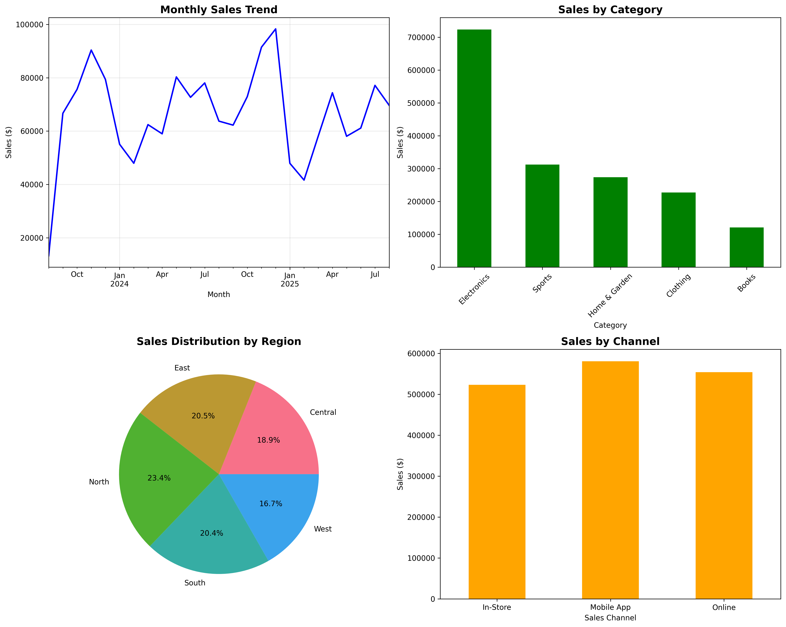
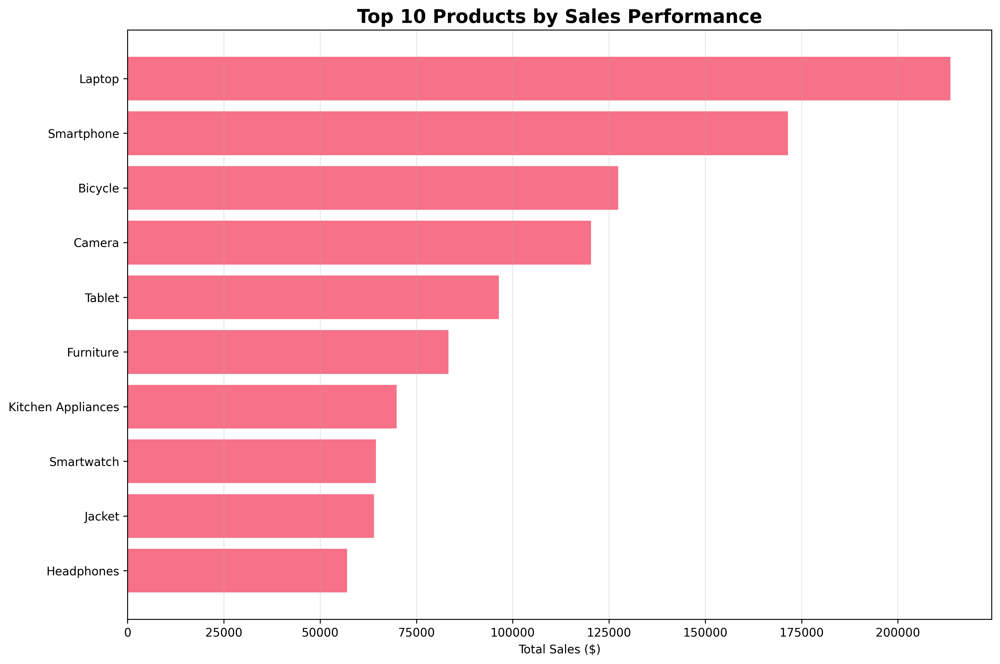

# Brainwave_Matrix_Intern# Brainwave Matrix Solutions: Sales Data Analysis Project

##  Internship Task 1

This repository contains the completed sales data analysis project for a commercial store, as part of the Data Science & Analytics internship at Brainwave Matrix Solutions.

---

### 📊 Project Overview

The goal of this project is to analyze two years of sales data to identify trends, top-performing products, and key business insights. The analysis covers sales trends, product performance, customer segmentation, and profitability to provide actionable recommendations for business growth.

---

### 🛠️ Technologies Used

* **Python:** Core language for analysis
* **Pandas & NumPy:** For data manipulation and numerical operations
* **Matplotlib & Seaborn:** For data visualization
* **Jupyter Notebook:** For interactive development and reporting

---

### 🔑 Key Findings

1.  **Top Category:** `Electronics & Gadgets` drives the most revenue.
2.  **Top Region:** The `North` region is the most profitable market.
3.  **Peak Season:** Sales peak significantly in **Q4** of each year.
4.  **Best Channel:** The `Online` sales channel is the most effective.
5.  **High-Margin Category:** `Home & Kitchen` products offer the best profit margins.

---

### 🚀 How to Run

1.  Clone the repository:
    ```bash
    git clone [https://github.com/gaurav171023/Brainwave_Matrix_Intern.git](https://github.com/gaurav171023/Brainwave_Matrix_Intern.git)
    ```
2.  Navigate to the project directory:
    ```bash
    cd Brainwave_Matrix_Intern
    ```
3.  Install the required libraries:
    ```bash
    pip install pandas numpy matplotlib seaborn jupyter notebook
    ```
4.  Open the analysis notebook:
    ```bash
    jupyter notebook notebooks/Sales_Data_Analysis.ipynb
    ```

---

### 🖼️ Sample Visualizations



